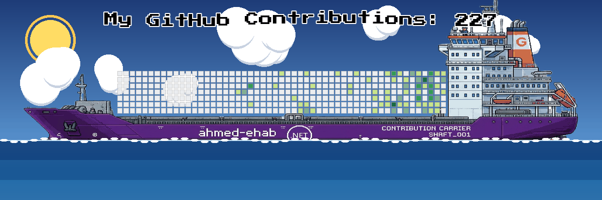

<div align="center">

<div align="center">
  <!-- Animated Typing Subheading -->
  <a href="https://github.com/Ahmed19765">
    
  </a>

</div>

  <p align="center">
    <a href="https://github.com/Ahmed19765">
      
    </a>
    
    
    
  </p>

  <!-- Quick Social Connect Icons -->
  <p align="center">
    <a href="https://linkedin.com/in/1ahmed-ehab" target="_blank">
      
    </a>
    <a href="mailto:ahmedmos5102003@gmail.com">
      
    </a>
    <a href="https://wa.me/201040239723" target="_blank">
      
    </a>
    <a href="https://github.com/Ahmed19765">
      
    </a>
  </p>

</div>

---

<div align="center">

### 🚢 My 2026 Contribution Ship



<sub>⚡ Auto-generated from my real 2026 GitHub activity — updates every 6 hours</sub>

</div>

---

### 👑 About Me

```csharp
using Microsoft.Extensions.DependencyInjection;
using Microsoft.Extensions.Hosting;

public class SoftwareEngineer : IEngineer
{
    public string Name => "Ahmed Ehab";
    public string Role => "Back-End .NET Developer & Full-Stack Engineer";
    public string Location => "Cairo, Egypt 🇪🇬 (Open to Remote / Relocation)";
    public string Education => "B.Sc. in Computer Science (2023 - 2027)";
    public string[] CoreStack => new[] { "C#", "ASP.NET Core", "EF Core", "CQRS + MediatR", "Clean/Onion Architecture" };
    public string[] Passions => new[] { "Clean Architecture", "Offline-First AI Tooling", "Cross-Platform UX", "Roslyn & Dev Tooling" };
 
    private readonly IProgrammer _programmer;
    private readonly IEnumerable<ICoreValue> _coreValues;
    private readonly IMindset _mindset;
    private readonly IMood _mood;
 
    public SoftwareEngineer(IProgrammer programmer,
                             IEnumerable<ICoreValue> coreValues,
                             IMindset mindset,
                             IMood mood)
    {
        _programmer = programmer;
        _coreValues = coreValues;
        _mindset = mindset;
        _mood = mood;
    }
 
    public void WorkEthic()
    {
        while (true)
        {
            _coreValues.WriteCleanCode();
            _mindset.ArchitectForScale();
            _programmer.DebugRelentlessly();   // step-by-step, one root cause at a time
            _programmer.ShipAcrossWebDesktopAndMobile();
            _mood.Recharge();
        }
    }
}
 
public static class ServiceCollectionExtensions
{
    public static IServiceCollection AddCareerServices(this IServiceCollection services)
    {
        services.AddSingleton<ICoreValue, CleanCode>();
        services.AddSingleton<ICoreValue, Integrity>();
        services.AddScoped<IMindset, ProblemSolver>();
        services.AddTransient<IMood, GameDevelopment>();
        services.AddScoped<IProgrammer, Ahmed>();
        services.AddHostedService<ContinuousLearning>();
 
        services.AddScoped<IEngineer, SoftwareEngineer>();
 
        return services;
    }
}
```

> **Crafting digital experiences with purpose.**
> I build fast, elegant, and scalable applications — from enterprise-grade Web APIs and microservices to native Windows tools and cross-platform mobile apps. My core engineering ethos centers around **Clean/Onion Architecture**, **CQRS**, **SOLID principles**, and writing code that's a pleasure to maintain and scale. Lately I've been pulling local LLMs into that toolkit too — building offline, privacy-first AI assistants for developers.

---

### 🚀 Core Engineering Pillars

<table>
  <tr>
    <td width="50%" valign="top">
      <h4>🌐 01. Backend & Distributed Systems</h4>
      <p>Enterprise back-ends with <b>ASP.NET Core</b>, <b>EF Core</b>, and <b>CQRS + MediatR</b>. Strict Onion/Clean Architecture layering, FluentValidation, JWT security, and resilient API design.</p>
    </td>
    <td width="50%" valign="top">
      <h4>💻 02. Desktop & Cross-Platform Mobile</h4>
      <p>Native Windows systems and cross-platform mobile apps with <b>WPF</b> and <b>.NET MAUI</b>. Hardware-aware, offline-capable, and built for real-time responsiveness (down to sub-pixel input precision).</p>
    </td>
  </tr>
  <tr>
    <td width="50%" valign="top">
      <h4>🤖 03. Offline & Local AI Tooling</h4>
      <p>Integrating local LLMs (via <b>Ollama</b>) into desktop apps to build privacy-first, offline AI assistants — no cloud dependency, full developer control.</p>
    </td>
    <td width="50%" valign="top">
      <h4>🏛️ 04. Architecture & Developer Tooling</h4>
      <p>Deep specialization in <b>Onion / Hexagonal Architecture</b> and custom Visual Studio extensions built on the <b>Roslyn Compiler API</b> for real-time code visualization.</p>
    </td>
  </tr>
</table>

---

### 🛠️ Tech Stack & Ecosystem

<div align="center">

<!-- Interactive Icon Cloud -->
<p>
  <a href="https://skillicons.dev">
    
  </a>
</p>

</div>

<br>

<details open>
<summary><b>📂 Categorized Technology Breakdown</b></summary>
<br>

| Domain | Technologies & Frameworks |
| :--- | :--- |
| **Languages** | `C# (.NET 8/9)`, `Python`, `SQL`, `JavaScript`, `TypeScript`, `XAML`, `HTML5/CSS3` |
| **Backend & Web** | `ASP.NET Core`, `EF Core`, `CQRS + MediatR`, `Web APIs (REST)`, `Microservices`, `YARP API Gateway`, `Razor Pages`, `ASP.NET Core Identity`, `JWT Auth`, `FluentValidation` |
| **Desktop & Mobile** | `.NET MAUI`, `WPF`, `MVVM Architecture`, `Xamarin` |
| **AI & Local LLMs** | `Ollama`, `Markdig` (Markdown rendering for AI chat UIs) |
| **Databases & ORM** | `Microsoft SQL Server`, `PostgreSQL`, `SQLite`, `MySQL`, `EF Core`, `Dapper`, `LINQ` |
| **Architecture & Craft** | `Clean Architecture`, `Onion Architecture`, `SOLID Principles`, `Domain-Driven Design (DDD)`, `Design Patterns` |
| **Game Dev (side pursuit)** | `Unity`, `C#`, `Unity Splines`, `New Input System` |
| **Cloud & DevOps** | `Microsoft Azure`, `Docker`, `CI/CD Pipelines`, `Git`, `GitHub Actions` |
| **Dev Tools & Libraries** | `Visual Studio Enterprise`, `VS Code`, `Roslyn Compiler API`, `VSIX Extensions`, `Postman`, `Pandas`, `Matplotlib` |

</details>

---

### 🌟 Featured Projects & Innovations

<table>
  <thead>
    <tr>
      <th width="24%">Project</th>
      <th width="42%">Description & Architecture Highlights</th>
      <th width="20%">Tech Stack</th>
      <th width="14%">Status</th>
    </tr>
  </thead>
  <tbody>
    <tr>
      <td>
        <b>🤖 SharpMate</b><br>
        <sub>Offline AI Companion for .NET Devs</sub>
      </td>
      <td>
        A desktop AI assistant for C#/.NET developers that runs entirely offline using local LLMs. Structured into UI, Application, Domain, and Infrastructure layers for strict Clean Architecture separation.
      </td>
      <td>
        
        
        
      </td>
      <td>🟢 Active</td>
    </tr>
    <tr>
      <td>
        <b>📚 Track Finder</b><br>
        <sub>AI-Powered Learning Platform</sub>
      </td>
      <td>
        A learning platform with a rich multi-section homepage, recently migrated to ASP.NET Core Identity with cookie auth and cache-based OTP verification for a smoother sign-in experience.
      </td>
      <td>
        
        
      </td>
      <td>🟢 Active</td>
    </tr>
    <tr>
      <td>
        <b>⚡ Company Management System</b><br>
        <sub>Enterprise Web API</sub>
      </td>
      <td>
        Production-grade modular API built with CQRS/MediatR and Onion Architecture — EF Core Fluent API configurations, dedicated command/query handlers, and FluentValidation rules throughout.
      </td>
      <td>
        
        
        
      </td>
      <td>✅ Completed</td>
    </tr>
    <tr>
      <td>
        <b>📱 VeliX</b><br>
        <sub>Mobile-to-PC Remote Control</sub>
      </td>
      <td>
        An Android-to-PC remote control app pairing a .NET MAUI client with a C# TCP server — sub-pixel mouse precision via an accumulator pattern, raw touch-event gesture detection, and a persistent reconnection loop.
      </td>
      <td>
        
        
      </td>
      <td>✅ Completed</td>
    </tr>
    <tr>
      <td>
        <b>🧅 OnionCSharp</b><br>
        <sub>Visual Studio VSIX Extension</sub>
      </td>
      <td>
        A developer extension that inspects class structures in real-time and renders visual cards with build-error integration — resolved phantom errors by parsing the Build output pane directly instead of relying on in-memory Roslyn compilation.
      </td>
      <td>
        
        
        
      </td>
      <td>🟢 Active</td>
    </tr>
    <tr>
      <td>
        <b>🛋️ Bayt Al-Anaka</b><br>
        <sub>Freelance E-Commerce Platform</sub>
      </td>
      <td>
        A furniture e-commerce platform built end-to-end for a freelance client, complete with full project documentation delivered in both PDF and Word.
      </td>
      <td>
        
        
      </td>
      <td>✅ Delivered</td>
    </tr>
    <tr>
      <td>
        <b>🥇 Airport Operations Intelligence</b><br>
        <sub>Data Analysis Competition Winner</sub>
      </td>
      <td>
        Award-winning data analysis model uncovering seasonal traffic bottlenecks, delay causalities, and airport transit flow patterns from live dataset pipelines. Ranked 1st place in the cohort.
      </td>
      <td>
        
        
      </td>
      <td>🏆 Award-Winning</td>
    </tr>
  </tbody>
</table>

<details>
<summary><b>🎮 Also cooking on the side: game dev</b></summary>
<br>

Building a Unity train game inspired by *Dead Rails* — iterating through waypoint-based movement, then spline-constrained rail movement with Unity Splines, now simple accelerating/braking forward movement with full Animator integration. Earlier project: a Unity car controller with realistic steering, braking, and handbrake/drift mechanics using the New Input System.

</details>

---

### 🏆 Honors & Credentials

```yaml
Formal Education:
  Degree: "B.Sc. in Computer Science"
  Institution: "Culture & Science City University (Cairo)"
  Duration: "2023 – 2027"
  Focus: "Distributed Systems, Data Structures, Algorithms, AI Career Advisor Graduation Project"

Specialized Programs & Badges:
  - Title: "DEPI (.NET Full-Stack Track)"
    Provider: "Ministry of Communications & Information Technology"
    Intensity: "450+ Hours of Intensive Enterprise Architecture, Microservices & Cloud"
  - Title: "DataCamp Data Analysis Champion"
    Achievement: "🥇 1st Place Winner in Airport Operation Data Analytics Challenge"
  - Title: "HackerRank Gold Level Problem Solver"
    Badges: "Gold badges in Algorithms, Data Structures, C#, SQL (Advanced) & 250+ Solutions"
  - Title: "SoloLearn Top Learner"
    Ranking: "Top 7% globally in Advanced C# and Object-Oriented Engineering"
  - Title: "Meta Back-End Professional Specialization"
    Skills: "Django, REST Framework, MySQL, API Optimization"
```

---

### 📊 GitHub Activity & Statistics Dashboard

<!-- GitHub Activity & Statistics Dashboard -->
<div align="center">

  <!-- GitHub Profile Trophies -->
  <a href="https://github.com/Ahmed19765">
    
  </a>

  <br><br>

  <!-- GitHub Stats & Top Languages Cards -->
  <table border="0" width="100%">
    <tr>
      <td width="50%" align="center" valign="top">
        <a href="https://github.com/Ahmed19765">
          
        </a>
      </td>
      <td width="50%" align="center" valign="top">
        <a href="https://github.com/Ahmed19765">
          
        </a>
      </td>
    </tr>
    <tr>
      <td colspan="2" align="center">
        <br>
        <a href="https://github.com/Ahmed19765">
          
        </a>
      </td>
    </tr>
  </table>

</div>

---

### 💬 Let's Build Something Exceptional Together

<div align="center">

  <p>I am always open to discussing new software architectures, freelance projects, enterprise roles, or collaborative open-source tools.</p>

  <a href="mailto:ahmedmos5102003@gmail.com">
    
  </a>
  <a href="https://linkedin.com/in/1ahmed-ehab" target="_blank">
    
  </a>
  <a href="https://wa.me/201040239723" target="_blank">
    
  </a>

  <br><br>

  <!-- Animated Footer Wave -->
  

  <sub>Designed &amp; crafted with 💜 and ☕ by <b>Ahmed Ehab</b> • Cairo, Egypt</sub>

</div>
